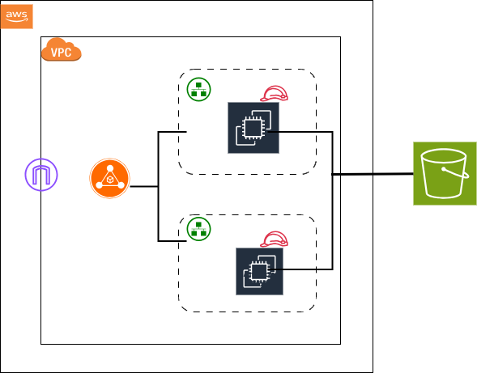

# 🚀 Automated AWS Infrastructure with Terraform

This project automates the creation of core AWS infrastructure using Terraform. It is designed for easy setup of a production-ready environment, including VPC, EC2, Security Groups, Load Balancer, S3, and IAM roles/policies.

---

## 📦 Components Deployed

- **VPC** with public/private subnets
- **Internet Gateway** and **NAT Gateway**
- **Route Tables**
- **EC2 Instances** with user-data scripts
- **Security Groups** (e.g., SSH, HTTP/S access)
- **Elastic Load Balancer (ALB)**
- **IAM Role & Policy**
- **S3 Bucket** (for logs or storage)

---

## AWS INFRA DIAGRAM

## SNAPSHOTS

